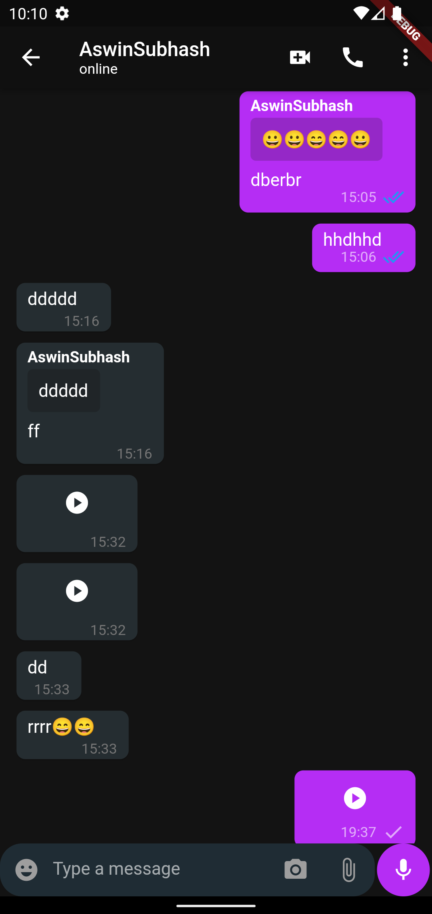
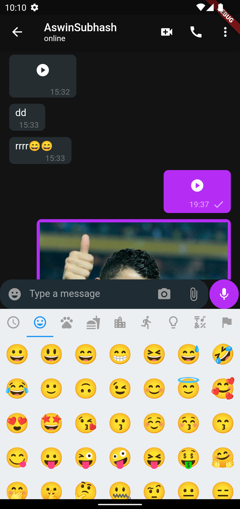

 # HeyChat

Heychat is a real-time chat application using flutter as framework  and firebase as back.Riverpod is used as statemanagement

## Table of contenst

- [Installation](#installation)
- [Usage](#usage)
- [Screenshots](#screenshots)
- [Packages and Credits](#packages-and-credits)
- [License](#license)

## Installation

To install and run this project, you will need to have the following dependencies installed on
your machine:
 - Flutter SDK
 - Android Studio or Visual Studio Code

To install the project, follow these steps:

1. Clone the repository to your local machine
2. Open the project in Android Studio or Visual Studio Code
3. Connect an Android device or lauch an emulator
4. Run the command 'flutter pub get' using the terminal
5. Run the project by clicking the "run" button in the top menu or by using the terminal
   command 'flutter run'
6. You need to change the firebase application file other wise it will not work

## Usage 

User can do  the following:

- Login using mobile number and otp is used for authenticating the number
- Can see online and offline statuses
- Reply messages
- Can send emojis
- Share audio, video, and images
- Video and audio call (on the process)
- Group chats, audio and video calls (on the process)

## Screenshots 

Home Screen                    |   Chat Screen             |  Media Chat   |  Emojis
:-------------------------:|:-------------------------:|:-------------------------:|:-------------------------:
|||

## Packages and Credits

- [Riverpod](https://github.com/rrousselGit/riverpod)
- [Cached network image](https://github.com/Baseflow/flutter_cached_network_image)
- [Cloud firestore](https://github.com/firebase/flutterfire/tree/master/packages/cloud_firestore/cloud_firestore)
- [Country picker](https://github.com/Daniel-Ioannou/flutter_country_picker)
- [Emoji picker flutter](https://github.com/Fintasys/emoji_picker_flutter)
- [Firebase auth](https://github.com/firebase/flutterfire/tree/master/packages/firebase_auth/firebase_auth)
- [Firebase core](https://github.com/firebase/flutterfire/tree/master/packages/firebase_core/firebase_core)
- [Flutter contacts](https://github.com/QuisApp/flutter_contacts)
- [Image picker](https://pub.dev/packages/image_picker)
- [Intl](https://github.com/dart-lang/intl)
- [Path provider](https://github.com/flutter/plugins/tree/main/packages/path_provider/path_provider)
- [Permission handler](https://github.com/baseflow/flutter-permission-handler)
- [Swipe to](https://github.com/Purvik/SwipeTo)
- [Uuid](https://github.com/Daegalus/dart-uuid)
- [Video player](https://github.com/flutter/plugins/tree/main/packages/video_player/video_player)
- [Audioplayers](https://github.com/bluefireteam/audioplayers/tree/main/packages/audioplayers)

## License

- MIT License
- Copyright 2022 © [ASWINSUBHASH](https://github.com/aswinsubhash)

